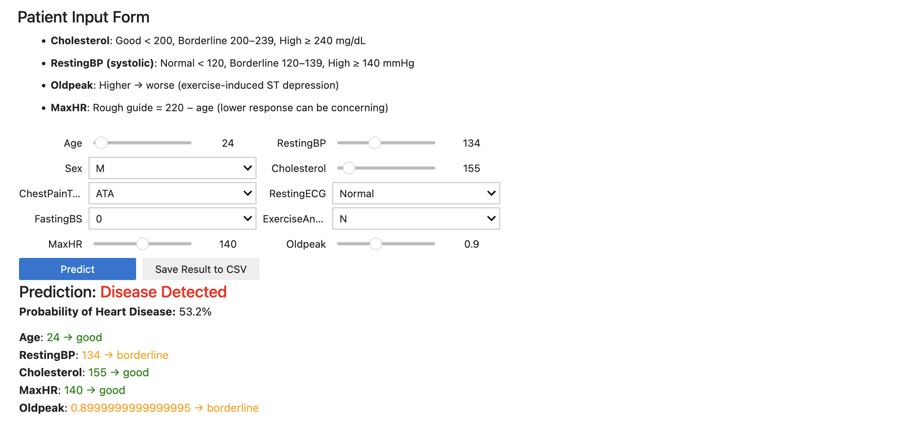
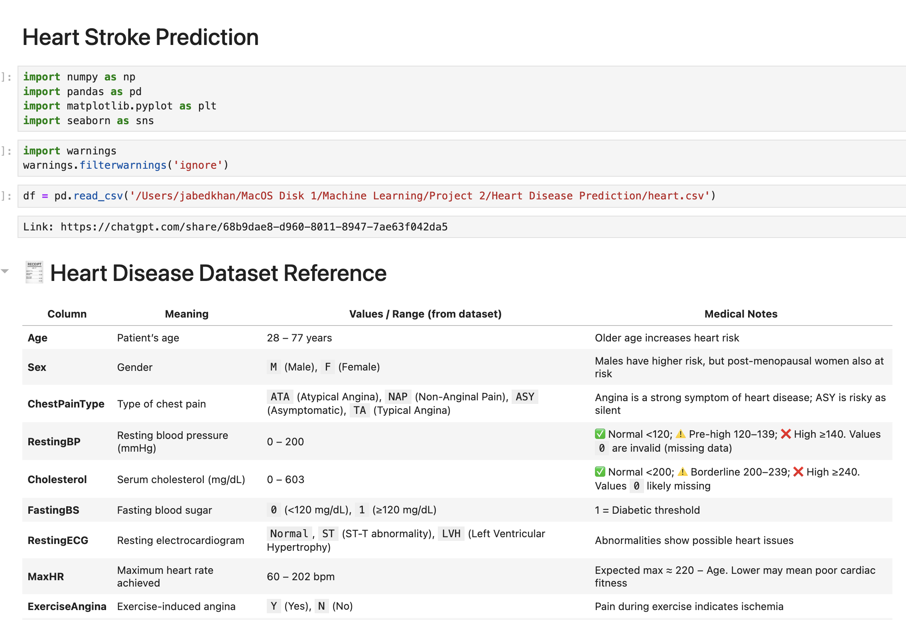
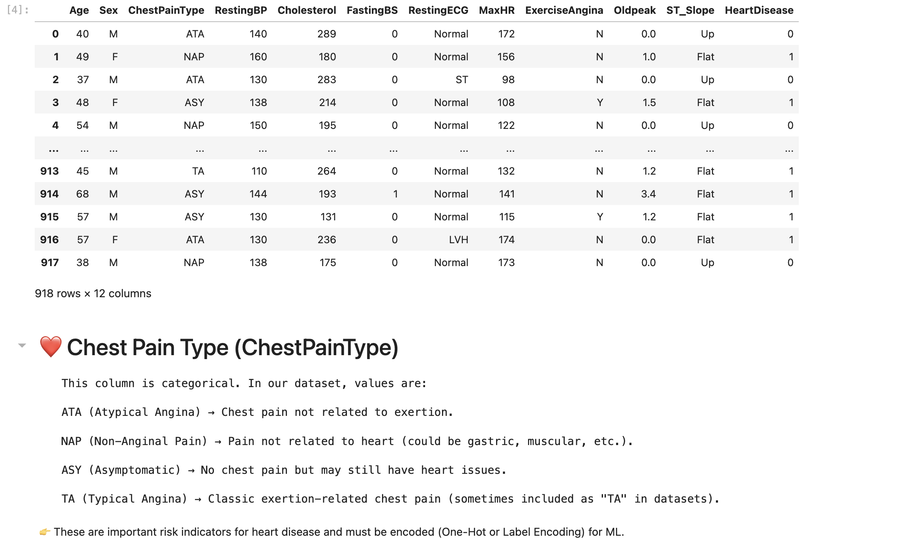
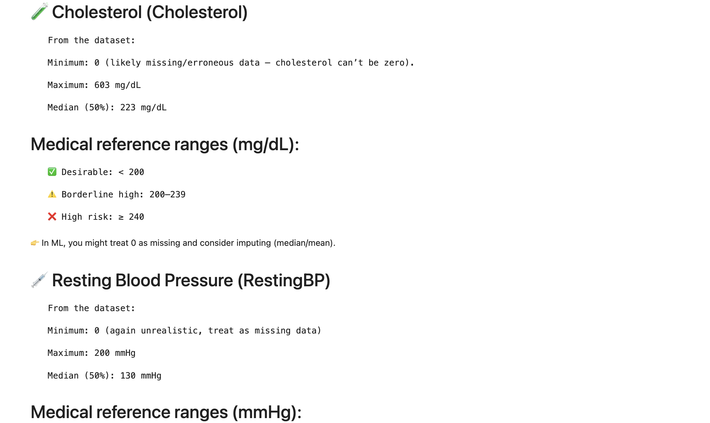
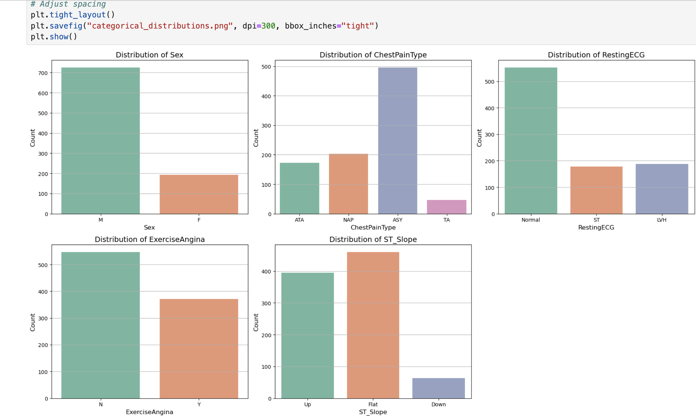
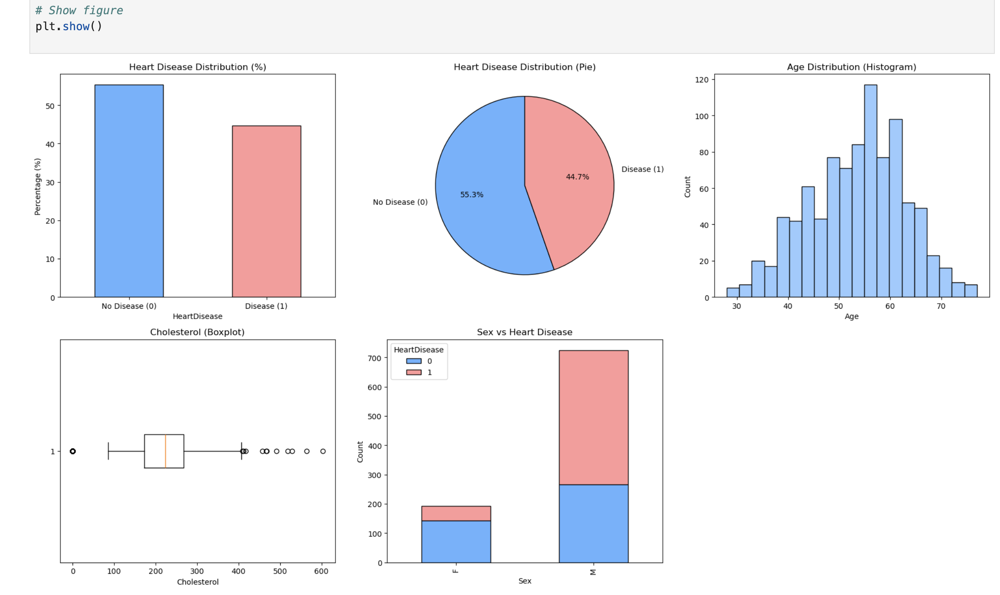
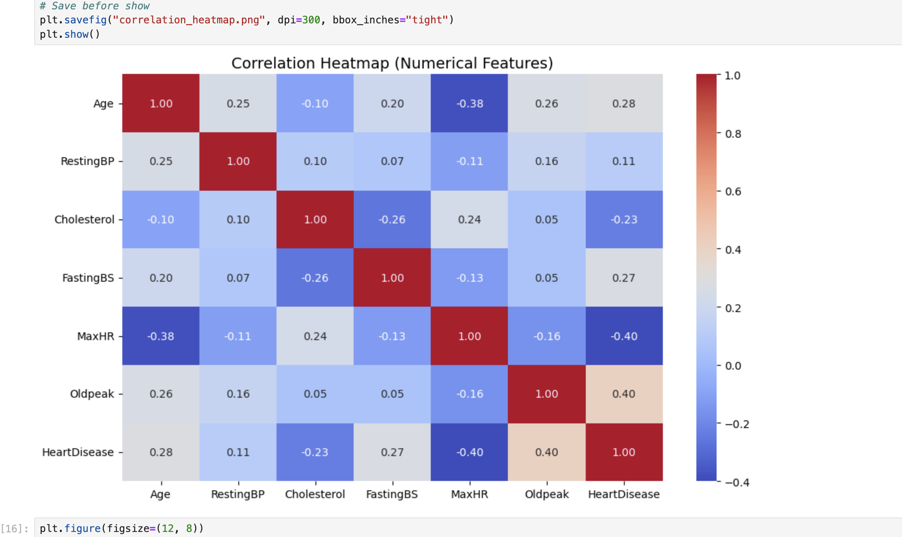
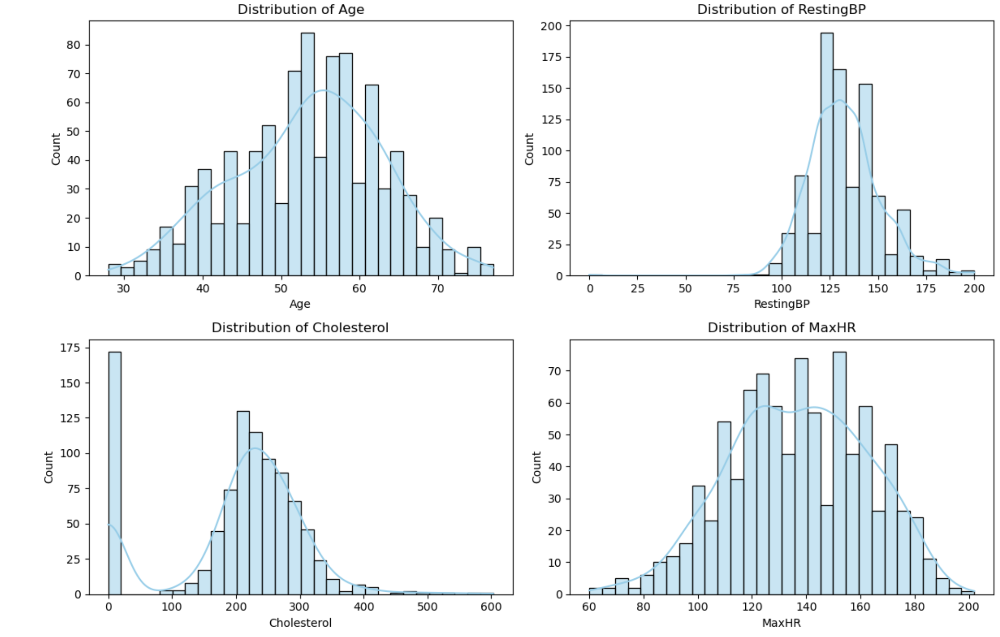
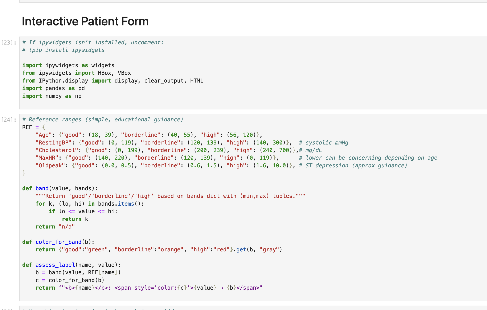

# 🧠 Heart Stroke Prediction using Machine Learning

This project predicts the risk of heart stroke using patient health indicators with Machine Learning.  
It covers data cleaning, EDA, visualization, model training, evaluation, and an interactive prediction form.  

---

## 📊 Visualizations & Results  

  
  
  
  
  
  
  
  
  
